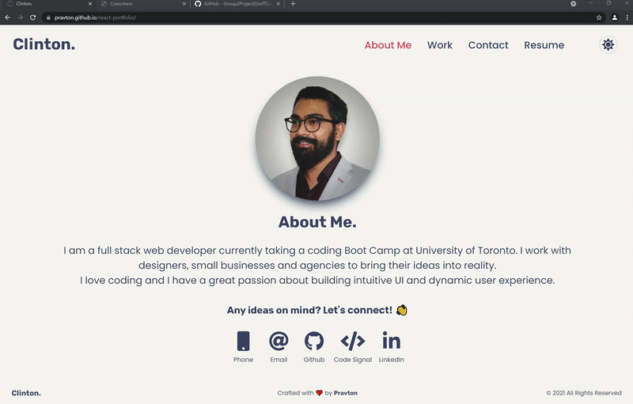

# REACT PORTFOLIO

      

## 📜 Description 

A simple portfolio to showcase my skills and recent projects. This portfolio was created using React. 

## 📋 Table Of Contents 
- [Installation](#%EF%B8%8F-installation)
- [Usage](#%EF%B8%8F-usage) 
- [Demo App Link](#-deployed-application-link) 
- [License](#-license) 
- [Contributing](#-contributing) 
- [Final Output GIF](#%EF%B8%8F-final-output-gif) 
- [Questions](#-questions) 

## ⚙️ Installation 

If you would like to try this application or want to use this as a demo, please clone the repo, and run the following command 

``` 
npm install
``` 

## 🖥️ Usage 

Start the server using the following command
``` 
npm start 
``` 
Runs the app in the development mode.
Open [http://localhost:3000](http://localhost:3000) to view it in the browser.

## 🌐 Deployed Application Link 

[**Click Here**](https://pravton.github.io/react-portfolio/) to view the deployed application. 

## ▶️ Final Output GIF 

 

## 📝 License 

This application is covered under the [MIT](https://choosealicense.com/licenses/mit/) license. 

## 🤝 Contributing 

Contributions, issues and feature requests are welcome. Feel free to check issues page if you want to contribute. 

## ❓ Questions 

If you have any questions regarding this application, please reach out via email or github! 

📧 Email : pravton_dev@outlook.com 

🤖 GitHub : https://github.com/pravton

